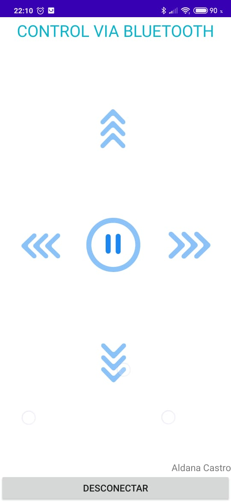

# controlArduino
## Un control para manejar vía bluetooth un robot de Arduino
Las flechas son animaciones en *.json* que se encuentran en la carpeta /app/src/main/assets.

Al presionar la flecha de arriba escribe una "G" que será la que se le envía al Arduino. La flecha para la derecha escribe "H", la de la izquierda "J", la de abajo "K" y el botón de pausa escribe una "I"

El desconectar sirve para cerrar la aplicación y terminar la conexión con el bluetooth.

En este video se puede observar el funcionamiento https://youtu.be/IHpkwLIOrMM

La aplicacion fue creada en Android Studio.

